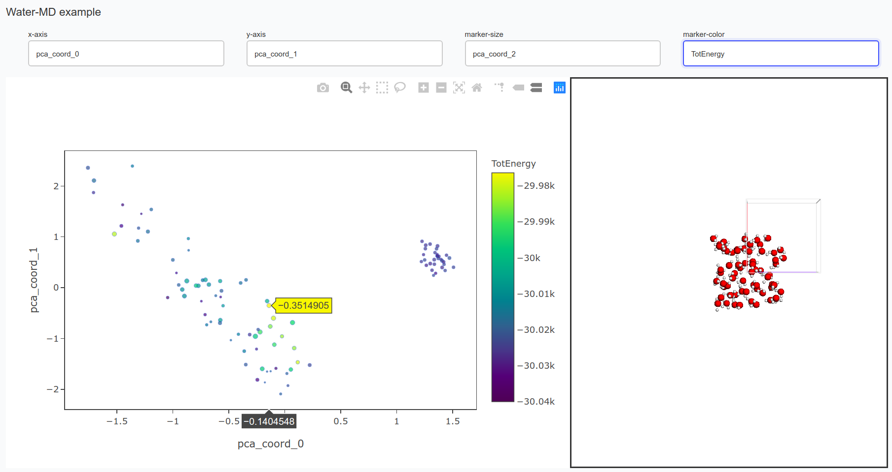

Visualizer for molecular structures/compounds from dimensionality reduction performed from ASAP.

Input is read from extended xyz files, written e.g. by ASE or ASAP 

#### Screenshot of the viewer in action

Visualization of MD-Snapshots (Water) using SOAP and PCA (performed in ASAP). Provided by @BingqingCheng

#### Dependencies and installation:

Easiest way: Install miniconda first and then install all listed packages using conda. Tested only with python3, not python2!

 - Numpy
 - plotly, dash, dash_bio_utils
 - dash_bio (You need to install a modified version from https://github.com/chkunkel/dash-bio, contact us!)
 - pandas
 - ASAP (https://github.com/BingqingCheng/ASAP, Ask BingqingCheng)
 - ASE (https://wiki.fysik.dtu.dk/ase/)
 
#### Howto:

0) Edit the file config.txt (explanations provided therein)
1) Run python visualize_plot.py
2) To visualize the results:
   - Find the created webpage in your browser at: http://localhost:9999/

 
#### Authors: 

Christian Kunkel (christian.kunkel@tum.de)

Simon Wengert (s.wengert@tum.de)

Tamas K. Stenczel (tks32@cam.ac.uk)

Licence so far: BY-SA

#### Todo:

- Max, min range for colormap, colormap chooser
- Max, min range for size, maybe a size-map, should show which size belongs to which property
- So far, every field is treatd as continous. It would be good to have a detection, whether a property is categorical,
  for example if there are less than 10 values possible. Then, the colorbar and sizes should map that also.
- Improve Design, some more eyecandy should be added!
- Possibility to switch to a 3D scatter plot 
