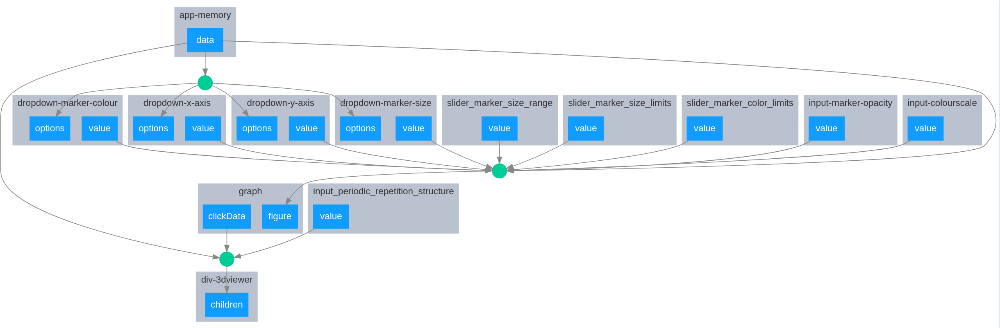

# Dev notes

*By Tamas K. Stenczel. Updated: 4 Feb 2020, before merge*

## ABCD integration 

- both scripts work with python and ipython as well now

Callback graph with ABCD:


Callback graph with no ABCD:


## WebGl

Might be good, but it looked hideous on some machines, so implemented with an option to turn it on and off, 
because it looks hideous on some machines.
The setting is stored in the app data, under style/webgl.

The default is True in `visualise_plot` and False in `visualise_abcd_summary` 

## hovertext
Added a limit to the number of lines in the hovertext, which is 20 now, but could add an option or some logic to set that.

  

## DATA structure

The layout keeps the application data in an element called `app-memory` that is a dictionary. 
The dictionary is constructed in two steps, at first the default keys are populated and then when an xyz file is opened
then the rest of them as well. The latter is carried out by `utils.load_xyz()`  

The dictionary has the following structure:

```
dict keys:
    # ones updated by default
    'styles': dict:
        title: title, not used by ABCD integrated version
        height_viewer
        width_viewer
        height_graph
        webgl: bool, use or not use WebGl in the visualiser
        **kwargs of `visualiser.get_style_config_dict`
    'soap_cutoff_radius':       float,      radius of SOAP spheres
    'marker_radius':            float,      marker radius for the inner green circle
    'mode':                     str,        `atomic` OR `molecular`

    # ones constructed by utils.load_xyz()
    'system_index':             (N,) int,   indices of the frames of tha atoms objects
    'atom_index_in_systems':    (N,) int,   indices of atoms inside the frames; None if mode=atomic
    'df_json':                              the dataframe in json format
    'atoms_list_json':          (N,) json,  list of the atoms objects, encoded into json format
    'list_hovertexts':          (N,) str,   list of texts (~HTML) to show on hovering over the points
    'mode':                     str,        mode saved
```