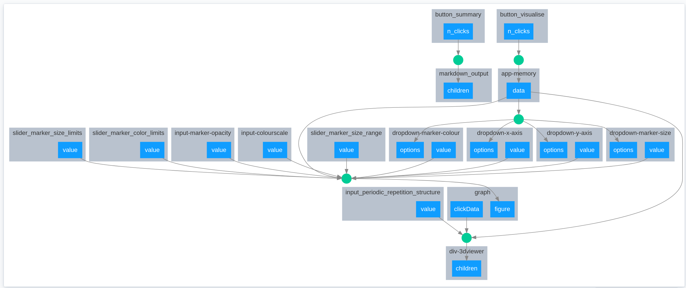

# Dev notes

*By Tamas K. Stenczel. Updated: 4 Feb 2020, before merge*

## ABCD integration 

- The script `visualize_abcd_summary` works with `ipython`

Callback graph with ABCD:



## DATA structure

The layout keeps the application data in an element called `app-memory` that is a dictionary with the following structure:

```
dict keys:
    'styles': dict:
        title: title, not used by ABCD integrated version
        height_viewer
        width_viewer
        height_graph
        **kwargs of `visualiser.get_style_config_dict`
    'soap_cutoff_radius':       float,      radius of SOAP spheres
    'marker_radius':            float,      marker radius for the inner green circle
    'mode':                     str,        `atomic` OR `molecular`


    # given by by utils.load_xyz()
    'system_index':             (N,) int,   indices of the frames of tha atoms objects
    'atom_index_in_systems':    (N,) int,   indices of atoms inside the frames; None if mode=atomic
    'df_json':                              the dataframe in json format
    'atoms_list_json':          (N,) json,  the atoms objects encoded into json format
    'mode':                     str,        mode saved
```